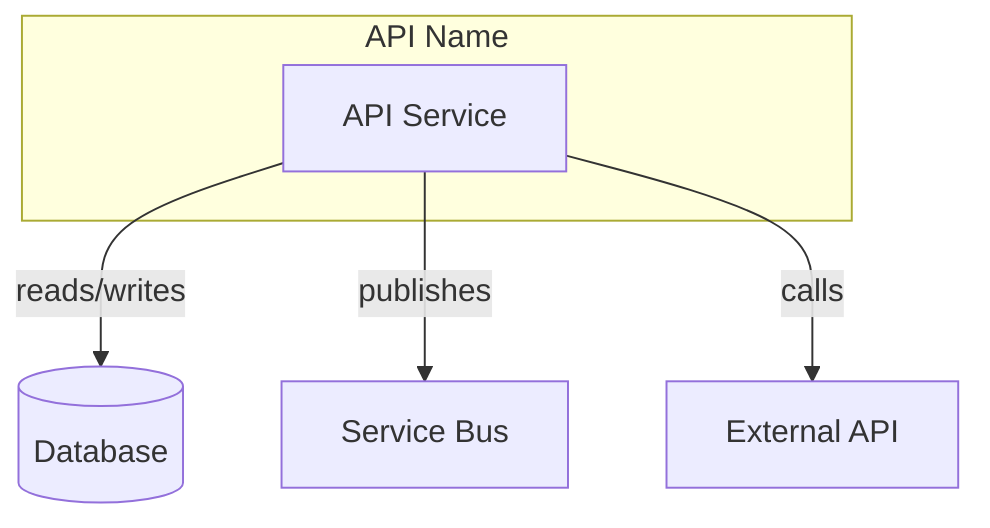

# SKILL: API Migration Analyser

## Overview
Analyses an API codebase for Azure subscription migration, producing a structured 
summary document. Designed for parallel execution across analysis domains.

## Trigger
When user asks to analyse an API for migration, or references this skill.

## Prerequisites
- Working directory is the API repository root
- User has provided any context about the target environment

## Execution Strategy

### Phase 1: Discovery (Sequential - Required First)
Single agent establishes codebase structure before parallel analysis.

**Tasks:**
1. Identify solution/project structure (`find . -name "*.csproj" -o -name "*.sln"`)
2. Locate entry points (Program.cs, Startup.cs, Function triggers)
3. Identify configuration files (appsettings*.json, *.bicep, *.tf)
4. Check for /readiness or /health endpoints
5. Identify dependency injection registrations
6. Detect job schedulers (Hangfire, HostedService, Timer triggers)

**Output:** `_discovery.json` with file paths and initial classification

---

### Phase 2: Parallel Analysis (5 Concurrent Agents)

#### Agent A: Core Identity
**Focus:** What is this API and what does it own?
**Analyse:**
- Purpose and business context (README, XML docs, namespace structure)
- Azure resources required (from bicep/terraform/ARM templates)
- Data persistence (DbContext, repositories, storage clients)
- PII/PHI classification

**Output sections:** 1 (Overview), 6 (Data Persistence), 10 (PII/PHI)

---

#### Agent B: Integration Surface
**Focus:** How does this API connect to the outside world?
**Analyse:**
- HTTP clients and their base URLs
- Service bus/queue connections
- Database connection strings
- Third-party SDKs (SendGrid, Twilio, AWS, etc.)
- gRPC/REST client registrations

**Output sections:** 2 (Dependencies)

---

#### Agent C: API Contract
**Focus:** What does this API expose?
**Analyse:**
- Controller routes and HTTP methods
- Authentication attributes ([Authorize], API key middleware)
- Request/response models
- OpenAPI/Swagger definitions if present
- Deprecation markers

**Output sections:** 3 (Endpoints) - summarised, not exhaustive code paths

---

#### Agent D: Messaging & Jobs
**Focus:** Asynchronous behaviour
**Analyse:**
- Message handlers (IHandleMessages, Functions with triggers)
- Event publishers (IPublishEndpoint, ITopicClient)
- Background jobs and schedules
- Hosted services

**Output sections:** 4 (Messages Consumed), 5 (Messages Published), 7 (Background Jobs)

---

#### Agent E: Infrastructure & Security
**Focus:** Deployment and access requirements
**Analyse:**
- Configuration settings and their sources
- Key Vault references
- Managed identity usage
- Required Azure roles/permissions
- CI/CD workflows
- Outbound network requirements (URLs, ports)

**Output sections:** 8 (Configuration), 9 (Permissions), 11 (Workflows), 12 (Packages)

---

### Phase 3: Consolidation (Sequential)

#### Consolidation Tasks:
1. **Cross-validate:** Compare declared dependencies (Agent B) against actual usage (Agents C, D)
2. **Risk synthesis:** Identify migration risks from all agent outputs
3. **Diagram generation:** Create C4 context diagram using **pm7y-mermaid-diagram skill** (see below)
4. **Gap detection:** Flag sections marked "Not determinable" for dev team questions
5. **Priority ranking:** Order risks by migration impact

**Output sections:** 13 (Diagram), 14 (Risks), 15 (Appendix), 16 (Questions)

#### Diagram Generation (using pm7y-mermaid-diagram skill)

When creating the C4 context diagram for Section 13, **invoke the pm7y-mermaid-diagram skill** to ensure syntactically correct output. Use `flowchart TD` for the C4 context diagram with:

- **External systems** as nodes outside subgraphs
- **The API** in a central subgraph
- **Dependencies** (databases, queues, external APIs) as connected nodes
- **Labels** showing the relationship (e.g., "reads from", "publishes to")

**Example structure:**


Follow all pm7y-mermaid-diagram rules:
- Use double quotes for labels with special characters
- Use `subgraph ID["Title"]` syntax
- Avoid lowercase "end" as node names
- No `Note` keyword in flowcharts

---

## Output Format

### File: `API_Summary.md`
```markdown
# {API Name} Migration Summary

> Generated: {date}
> Repository: {repo path}
> Confidence: {High|Medium|Low} - based on code coverage of analysis

## Quick Reference
| Attribute | Value |
|-----------|-------|
| Critical Dependencies | {count} |
| PII/PHI Present | Y/N |
| Background Jobs | {count} |
| Migration Risk Level | {High|Medium|Low} |

## Migration Blockers (Review First)
{Top 3 critical risks that could prevent migration}

---

{Sections 1-16 as per original spec, but with validated cross-references}
```

---

## Section Specifications

### Tables - Standard Columns

All tables include a **Confidence** column:
- ✅ Verified in code
- ⚠️ Inferred from patterns
- ❓ Not determinable

### Section Modifications from Original

| Section | Change | Rationale |
|---------|--------|-----------|
| 3 (Endpoints) | Summarise by controller, not exhaustive code paths | Performance; full paths rarely needed for migration |
| 10 (PII/PHI) | Add "Encryption at Rest" column | Critical for HIPAA compliance verification |
| 13 (Diagram) | Remove "Microsoft Loop compatible" requirement | Too vague; standard Mermaid is sufficient |
| 14 (Risks) | Move to top of document as "Migration Blockers" | Visibility for decision-makers |
| 15 (Appendix) | Replace with structured "Migration Notes" checklist | Prevents rambling |

---

## Validation Rules

Before finalising output, verify:
- [ ] Every dependency in Section 2 appears in at least one endpoint/job/handler
- [ ] Every external URL has a corresponding firewall rule suggestion
- [ ] PII/PHI classification aligns with data persistence entries
- [ ] Background jobs that "Send Communications" have corresponding dependencies
- [ ] Questions for dev team are specific and actionable (not generic)

---

## Error Handling

| Condition | Action |
|-----------|--------|
| No .csproj found | Abort with "Not a .NET repository" message |
| No configuration files | Warn and continue; note in Appendix |
| Circular dependencies detected | Flag as Critical risk |
| Analysis timeout on large codebase | Complete available sections; note incomplete areas |