# Class Diagram Complete Reference

Complete syntax for mermaid class diagrams.

---

## Declaration

```mermaid
classDiagram
```

---

## Class Definition

### Basic Class

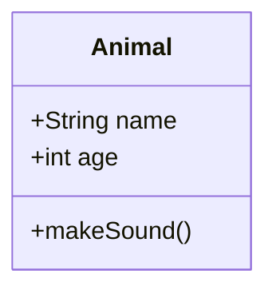

### Visibility Modifiers

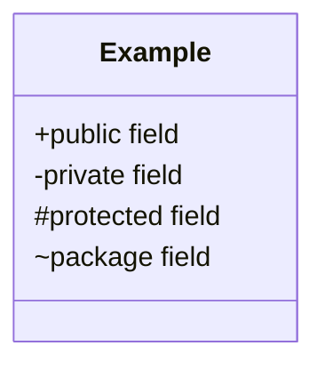

### Static Members

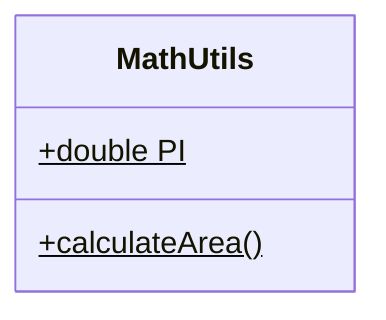

**Note:** `$` suffix indicates static

---

## Member Syntax

### Fields

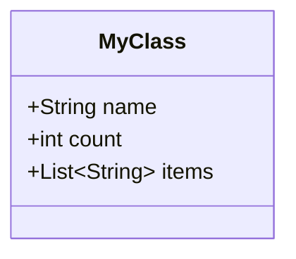

**Generic types:** Use `~` for generics: `List~String~`

### Methods

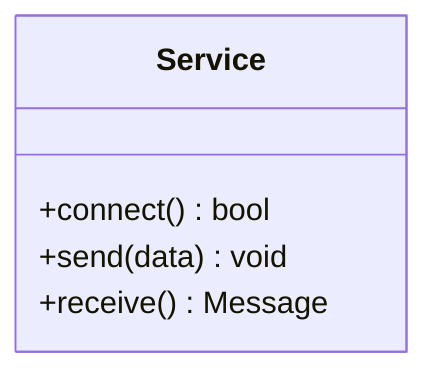

**Format:** `methodName(params) ReturnType`

**Important:** No colon before return type!

---

## Relationships

### Inheritance

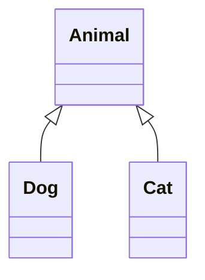

**Syntax:** `Parent <|-- Child`

---

### Composition

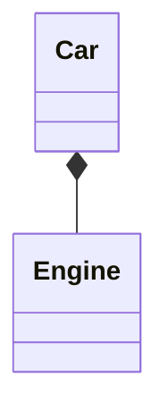

**Meaning:** Car has Engine (strong ownership)

---

### Aggregation

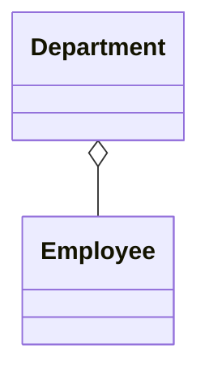

**Meaning:** Department has Employees (weak ownership)

---

### Association

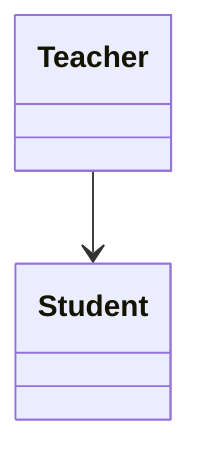

---

### Dependency

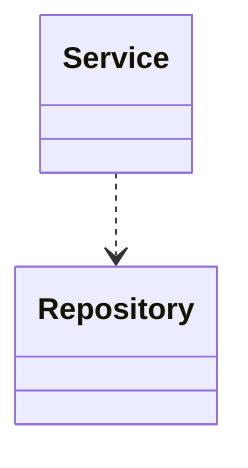

---

### Realization (Interface)

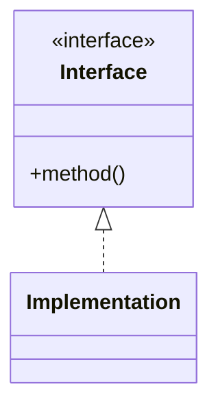

---

## Multiplicity

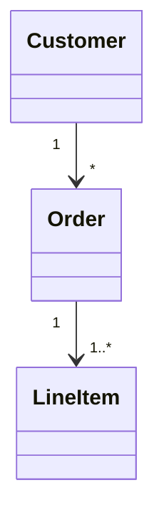

---

## Labels on Relationships

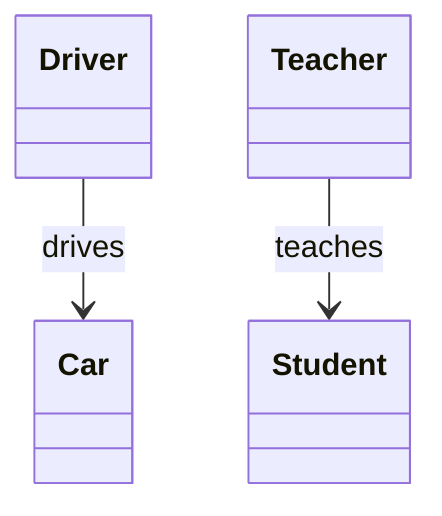

**Format:** `Class1 --> Class2 : label`

**Important:** Space before and after `:`

---

## Annotations

### Stereotypes

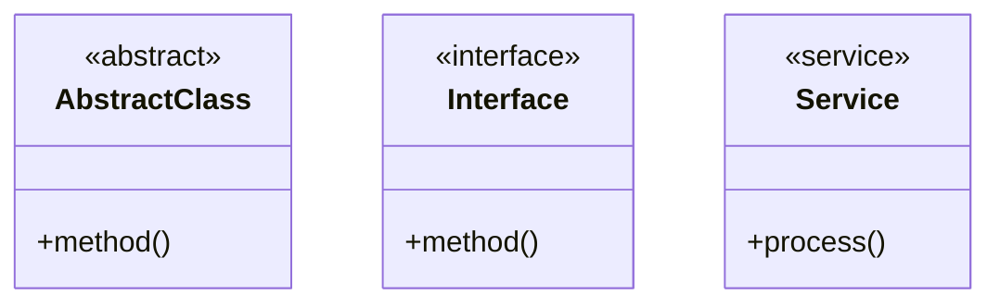

---

## Namespaces

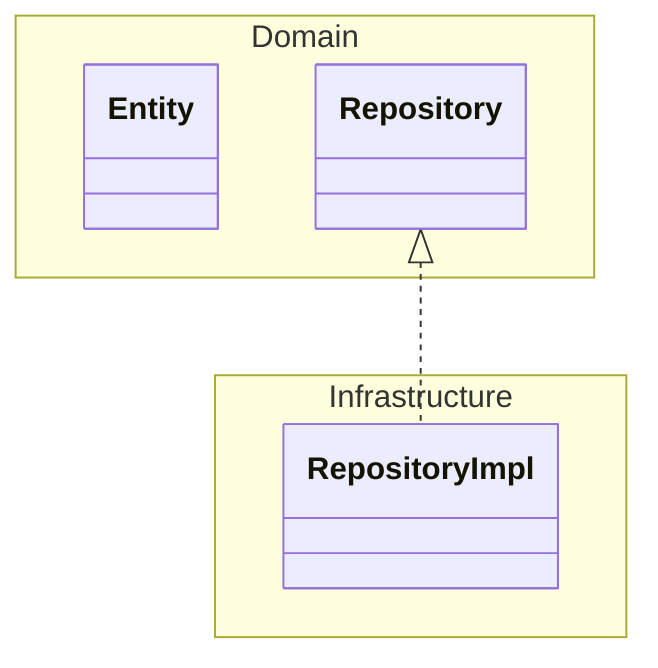

---

## Complete Example

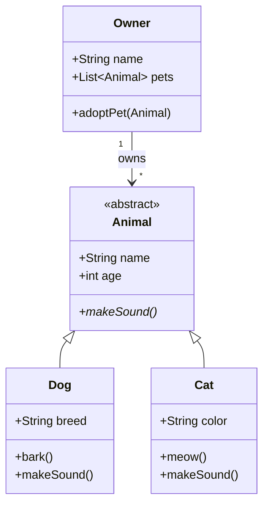

---

## Common Errors

### Error 1: Colon in method syntax

**Broken:**
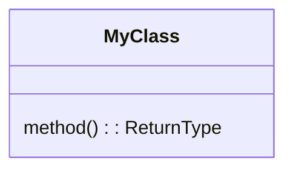

**Fixed:**
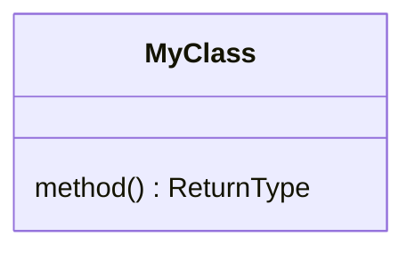

---

### Error 2: Undefined node in relationship

**Broken:**
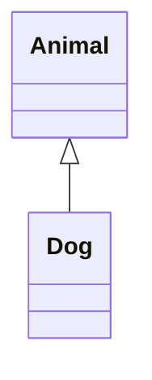

**Fixed:**
```mermaid
classDiagram
    class Animal
    class Dog
    Animal <|-- Dog
```

**Rule:** Define all classes before relationships

---

### Error 3: Special characters in class name

**Broken:**
```mermaid
classDiagram
    class My:Class
```

**Fixed:**
```mermaid
classDiagram
    class MyClass
```

---

### Error 4: Generic syntax

**Broken:**
```mermaid
classDiagram
    class List<String>
```

**Fixed:**
```mermaid
classDiagram
    class List~String~
```

**Use:** `~` instead of `<>`

---

## Method Parameter Syntax

### Simple

```mermaid
classDiagram
    class Service {
        +send(data)
        +receive() Message
    }
```

### Multiple Parameters

```mermaid
classDiagram
    class Math {
        +add(a, b) int
        +multiply(x, y, z) int
    }
```

**Note:** Parameter types usually omitted for clarity

---

## Styling

```mermaid
classDiagram
    class Important {
        +criticalMethod()
    }

    class Normal {
        +regularMethod()
    }

    style Important fill:#ffcccc,stroke:#ff0000,stroke-width:4px
```

---

## Class Diagram vs Object Diagram

**Class diagram:** Shows classes and relationships (design time)

```mermaid
classDiagram
    Customer --> Order
```

**Object diagram:** Shows instances (runtime) - not standard mermaid

Use class diagram with stereotypes for object-like diagrams.

---

## Best Practices

1. **Define first:** All classes before relationships
2. **Keep methods simple:** Avoid complex parameter types
3. **Use stereotypes:** `<<interface>>`, `<<abstract>>` for clarity
4. **Consistent visibility:** Use `+`, `-`, `#` consistently
5. **Group related:** Use namespaces for large diagrams

---

## Quick Reference

| Relationship | Syntax | Meaning |
|-------------|--------|---------|
| Inheritance | `A <\|-- B` | B extends A |
| Composition | `A *-- B` | A owns B (strong) |
| Aggregation | `A o-- B` | A has B (weak) |
| Association | `A --> B` | A uses B |
| Dependency | `A ..> B` | A depends on B |
| Realization | `A <\|.. B` | B implements A |

---

Return to [SKILL.md](SKILL.md)
