# Common Mermaid Errors and Solutions

Based on 76 diagram corrections in Swift-Selena project (2025-10-24〜26).

---

## Error Category 1: Special Characters

### Error: "Parse error" with colons

**Broken:**
```mermaid
flowchart LR
    A[Function: process()]
```

**Fixed:**
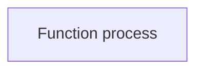

**Lesson:** Remove `:` or use `"Function&#58; process()"`

---

### Error: Brackets in labels

**Broken:**
```mermaid
flowchart LR
    A[Array [1,2,3]]
```

**Fixed:**
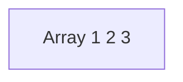

**Lesson:** Remove `[]` or use `&#91;` `&#93;`

---

### Error: Parentheses in method names

**Broken:**
```mermaid
flowchart LR
    A[method(param)]
```

**Fixed:**
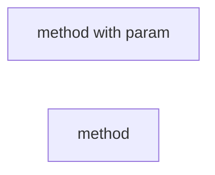

**Lesson:** Remove `()` from flowchart labels or use HTML entities

---

## Error Category 2: Reserved Words

### Error: Lowercase "end"

**Broken:**
```mermaid
flowchart TD
    Start --> end
```

**Fixed:**
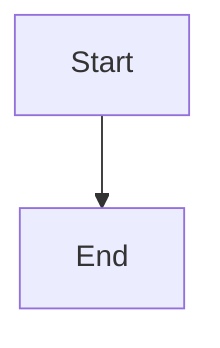

**Lesson:** Always capitalize: `End`, `END`, or `E_N_D`

---

### Error: "o" at edge start creates circle

**Broken:**
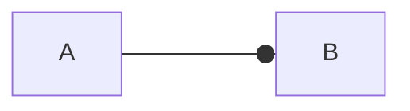

**Result:** Circle edge `o` appears

**Fixed:**
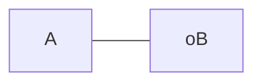

**Lesson:** Add space before "o"

---

## Error Category 3: Subgraph Syntax

### Error: Subgraph without ID

**Broken:**
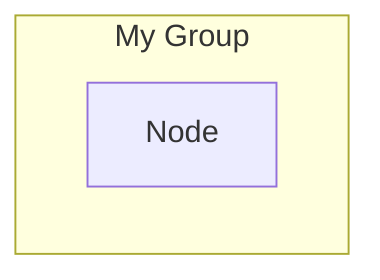

**Fixed:**


**Lesson:** Always provide ID: `subgraph ID["Title"]`

---

## Error Category 4: Note Misuse

### Error: Note in flowchart

**Broken:**
```mermaid
flowchart TD
    A[Node]
    Note: This is important
```

**Fixed (Option A):**
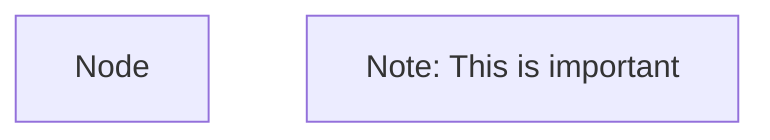

**Fixed (Option B):**
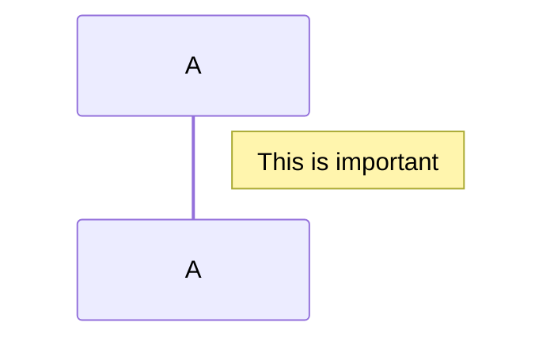

**Lesson:** `Note` keyword only exists in sequenceDiagram

---

## Error Category 5: classDiagram

### Error: Undefined node reference

**Broken:**
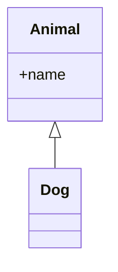

**Fixed:**


**Lesson:** Define all classes before creating relationships

---

### Error: Method syntax

**Broken:**
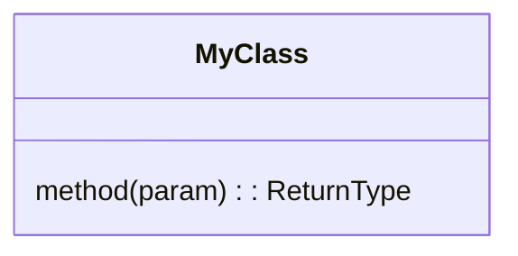

**Fixed:**
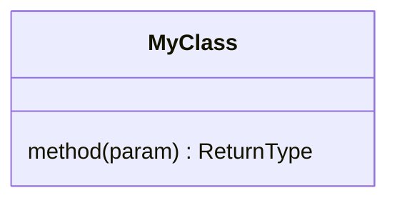

**Lesson:** No colon before return type

---

## Error Category 6: Edge Labels

### Error: Edge label with special chars

**Broken:**
```mermaid
flowchart LR
    A -->|process()| B
```

**Fixed:**
```mermaid
flowchart LR
    A -->|process| B
```

**Lesson:** Avoid `()`, `:`, `[]` in edge labels

---

## Top 10 Most Common Errors (From Experience)

1. `:` in labels (30+ occurrences)
2. `()` in flowchart labels (20+ occurrences)
3. Subgraph without ID (15+ occurrences)
4. Note in flowchart (8 occurrences)
5. Lowercase "end" (5 occurrences)
6. `[]` in labels (12 occurrences)
7. `@` in labels (6 occurrences)
8. Undefined classDiagram nodes (4 occurrences)
9. Method colon syntax (3 occurrences)
10. Edge label brackets (2 occurrences)

---

## Prevention Strategy

**Before creating:**
1. Check for special chars in content
2. Check for reserved words
3. Plan subgraph structure with IDs

**While creating:**
1. Use double quotes liberally
2. Test with simple version first
3. Add complexity incrementally

**After creating:**
1. Validate syntax (paste in mermaid live editor)
2. Check rendering
3. Fix any errors immediately

---

## Real Error Examples from Swift-Selena

### Example 1: DES-101

**Broken (line 158):**
```mermaid
flowchart TD
    SMCP[SwiftMCPServer: ListTools/CallTool]
```

**Fixed:**
```mermaid
flowchart TD
    SMCP["SwiftMCPServer<br/>- ListTools<br/>- CallTool"]
```

---

### Example 2: DES-102

**Broken (line 689):**
```mermaid
sequenceDiagram
    Client->>LSP: textDocument/documentSymbol
```

**Fixed:**
```mermaid
sequenceDiagram
    Client->>LSP: textDocument documentSymbol
```

---

### Example 3: DES-103

**Broken (line 485):**
```mermaid
classDiagram
    class ToolHelpers {
        requireProjectMemory(ProjectMemory?) ProjectMemory$
    }
```

**Fixed:**
```mermaid
classDiagram
    class ToolHelpers {
        <<Enum>>
        +requireProjectMemory(args) ProjectMemory$
    }
```

---

## Reference

For complete syntax details:
- [Mermaid Official Docs](https://mermaid.js.org/)
- [flowchart-reference.md](flowchart-reference.md)
- [sequence-reference.md](sequence-reference.md)
- [class-reference.md](class-reference.md)
