# Flowchart Complete Reference

Complete syntax specification for mermaid flowcharts.

---

## Declaration

```mermaid
flowchart DIRECTION
```

**Direction options:**
- `TD` / `TB` - Top to bottom
- `BT` - Bottom to top
- `LR` - Left to right
- `RL` - Right to left

**Alias:** `graph TD` (same as `flowchart TD`)

---

## Node Shapes

### Rectangle
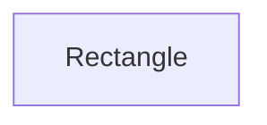

### Rounded Rectangle
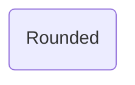

### Stadium
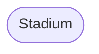

### Subroutine
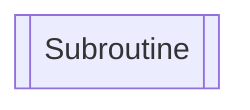

### Cylindrical
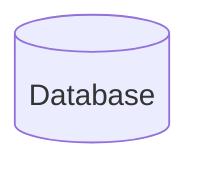

### Circle
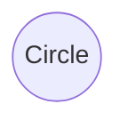

### Asymmetric
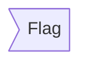

### Rhombus (Decision)
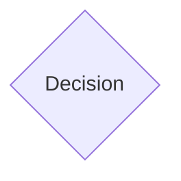

### Hexagon
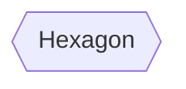

### Parallelogram
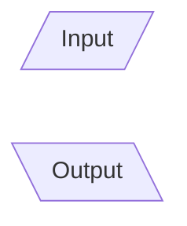

### Trapezoid
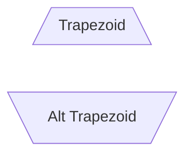

---

## Edges (Arrows)

### Basic Arrows

```mermaid
flowchart LR
    A --> B   %% Solid arrow
    C --- D   %% Line (no arrow)
    E -.-> F  %% Dotted arrow
    G ==> H   %% Thick arrow
```

### Arrow Variations

```mermaid
flowchart LR
    A --o B   %% Circle end
    C --x D   %% Cross end
    E <--> F  %% Bidirectional
    G o--o H  %% Circle both ends
    I x--x J  %% Cross both ends
```

### Edge Labels

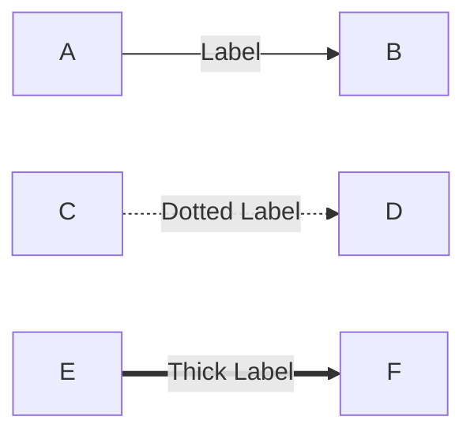

**Important:** Avoid special characters in labels!

---

## Subgraphs

### Basic Subgraph

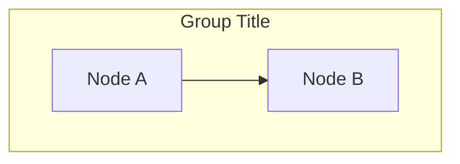

### Nested Subgraphs

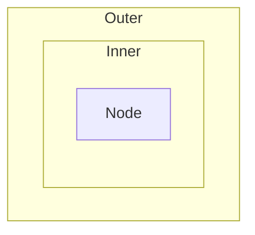

### Subgraph Direction

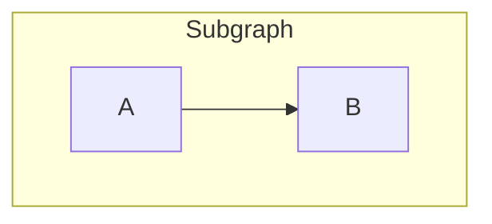

### Edges to/from Subgraphs

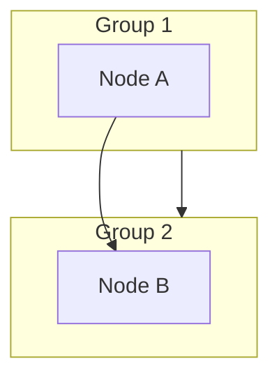

---

## Styling

### Inline Style

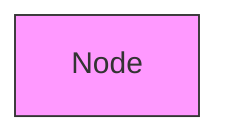

### Style Command

```mermaid
flowchart LR
    A[Node A]
    B[Node B]

    style A fill:#bbf,stroke:#333,stroke-width:4px
    style B fill:#f9f
```

### Class Definition

```mermaid
flowchart LR
    A[Success]:::success
    B[Error]:::error

    classDef success fill:#c8e6c9,stroke:#4caf50
    classDef error fill:#ffcdd2,stroke:#f44336
```

---

## Special Characters Handling

### Double Quote Method

```mermaid
flowchart LR
    A["Method: process()"]
    B["Array [1, 2, 3]"]
    C["Email: user@example.com"]
```

### HTML Entity Method

```mermaid
flowchart LR
    A[Method&#58; process&#40;&#41;]
    B[Array &#91;1&#93;]
```

**Common entities:**
- `:` → `&#58;`
- `(` → `&#40;`
- `)` → `&#41;`
- `[` → `&#91;`
- `]` → `&#93;`
- `{` → `&#123;`
- `}` → `&#125;`
- `@` → `&#64;`
- `;` → `&#59;`

---

## Line Breaks in Labels

Use `<br/>` for multiline labels:

```mermaid
flowchart TD
    A["Line 1<br/>Line 2<br/>Line 3"]
```

---

## Comments

```mermaid
flowchart TD
    %% This is a comment
    A[Node]  %% Inline comment
```

**Important:** Don't use `{}` in comments

---

## Reserved Words to Avoid

**Avoid as node IDs (or capitalize):**
- `end` → `End` or `END`
- `class` (in some contexts)

**Safe alternatives:**
- Use descriptive names: `EndProcess`, `FinalState`
- Add prefix/suffix: `end_node`, `node_end`

---

## Common Pitfalls

### Pitfall 1: Missing semicolons when needed

If using semicolons as line separators:
```mermaid
flowchart LR
    A-->B; B-->C; C-->D
```

### Pitfall 2: Quotes inside quotes

**Broken:**
```mermaid
flowchart LR
    A["Say "Hello""]
```

**Fixed:**
```mermaid
flowchart LR
    A["Say Hello"]
    B[Say &#34;Hello&#34;]
```

### Pitfall 3: Too many special chars

**Best practice:** Keep labels simple
- Good: `Process Data`
- OK: `Process: Data`
- Bad: `Process: [Data] (type: @string)`

---

## Debugging Strategy

### Step 1: Isolate the error

Comment out sections to find which node/edge causes the error:

```mermaid
flowchart TD
    A[Works]
    %% B[Might be broken]
    %% C{Also suspicious}
```

### Step 2: Simplify

Remove all special characters and test:

```mermaid
flowchart TD
    A[Simple]
    B[Also Simple]
    A --> B
```

### Step 3: Add back incrementally

Once basic version works, add complexity one element at a time.

---

## Real-World Error Fixes

### Fix 1: DES-101 System Architecture

**Before (broken):**
```
SwiftMCPServer: ListTools/CallTool
```

**After (fixed):**
```
SwiftMCPServer<br/>- ListTools<br/>- CallTool
```

---

### Fix 2: DES-102 LSP Protocol

**Before (broken):**
```
textDocument/references
```

**After (fixed):**
```
textDocument references
```

---

### Fix 3: DES-103 Class Structure

**Before (broken):**
```
requireProjectMemory(ProjectMemory?) ProjectMemory$
```

**After (fixed):**
```
requireProjectMemory(args) ProjectMemory$
```

---

## Quick Fix Reference

| Error Message | Likely Cause | Quick Fix |
|--------------|--------------|-----------|
| Parse error on line X | Special char in label | Add double quotes |
| Subgraph X not found | Missing ID | Add `subgraph ID["Title"]` |
| Syntax error in graph | Reserved word "end" | Capitalize to `End` |
| Unexpected token | Bracket/colon/parens | Remove or use `&#XX;` |
| Note is not defined | Note in flowchart | Use sequenceDiagram or regular node |

---

## Validation Checklist

Before considering diagram complete:

- [ ] No `:` without quotes
- [ ] No `()` in flowchart labels
- [ ] No `[]` in labels
- [ ] No `@` without quotes/entities
- [ ] All subgraphs have ID
- [ ] No lowercase "end"
- [ ] Note only in sequenceDiagram
- [ ] All classDiagram nodes defined
- [ ] Tested in live editor or render

---

## Reference

Return to [SKILL.md](SKILL.md) for main documentation.
