# Sequence Diagram Complete Reference

Complete syntax for mermaid sequence diagrams.

---

## Declaration

```mermaid
sequenceDiagram
```

---

## Participants

### Basic Definition

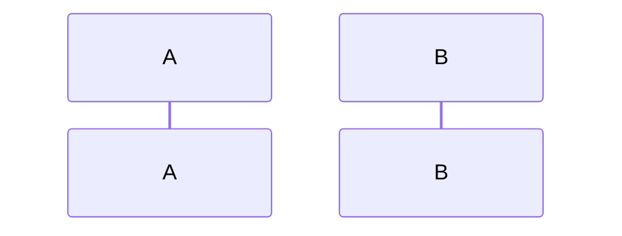

### With Aliases

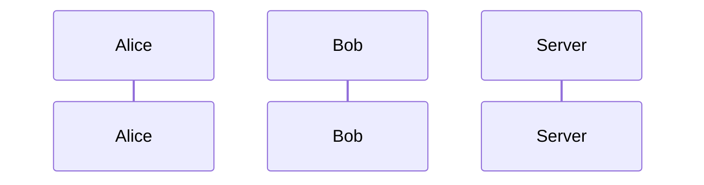

### Actor (Stick Figure)

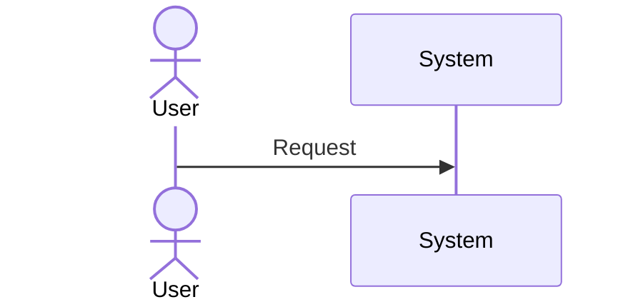

---

## Messages

### Arrow Types

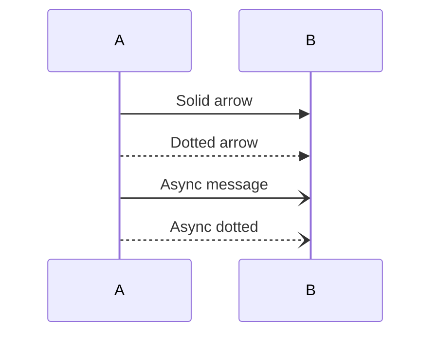

### Arrow Directions

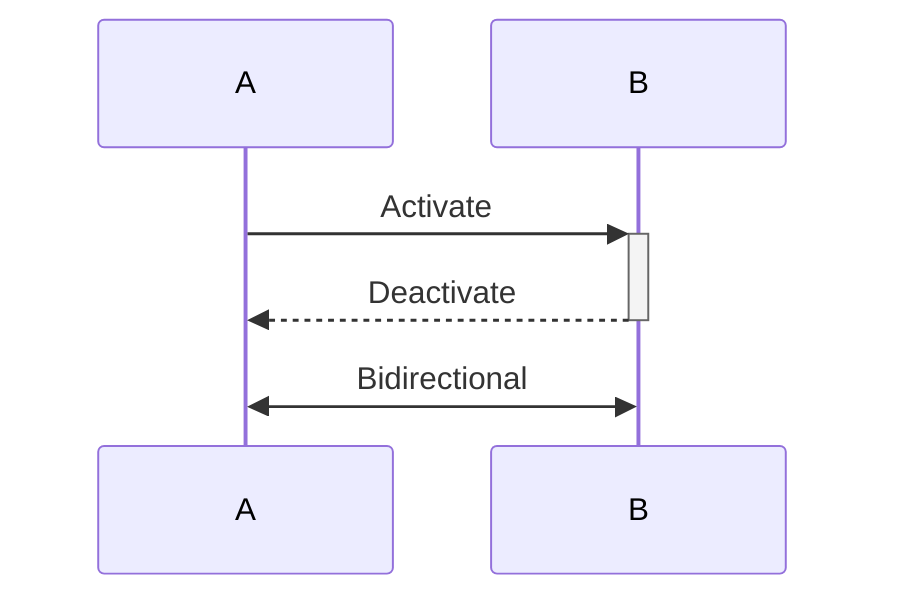

### Without Arrows

```mermaid
sequenceDiagram
    A-B: Solid line
    A--B: Dotted line
```

---

## Activation/Deactivation

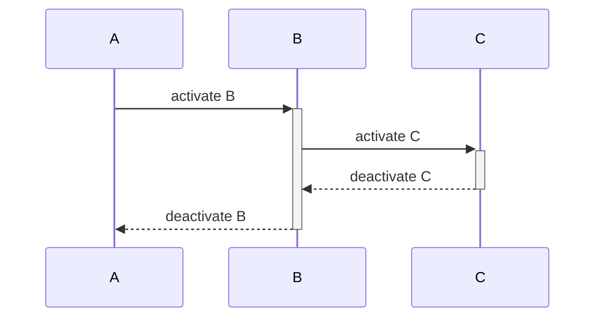

---

## Notes

### Position

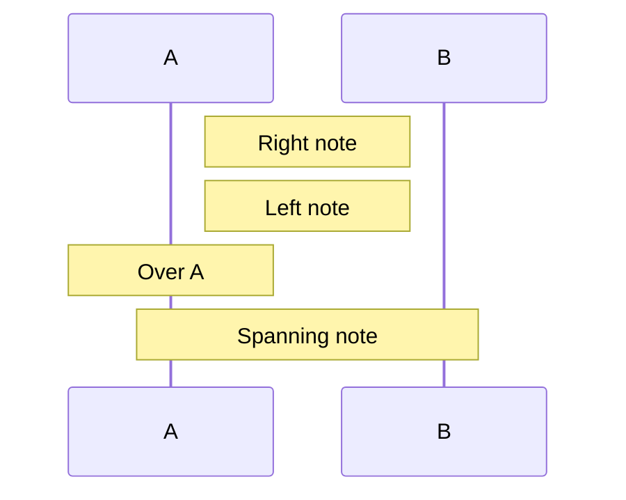

### Multiline Notes

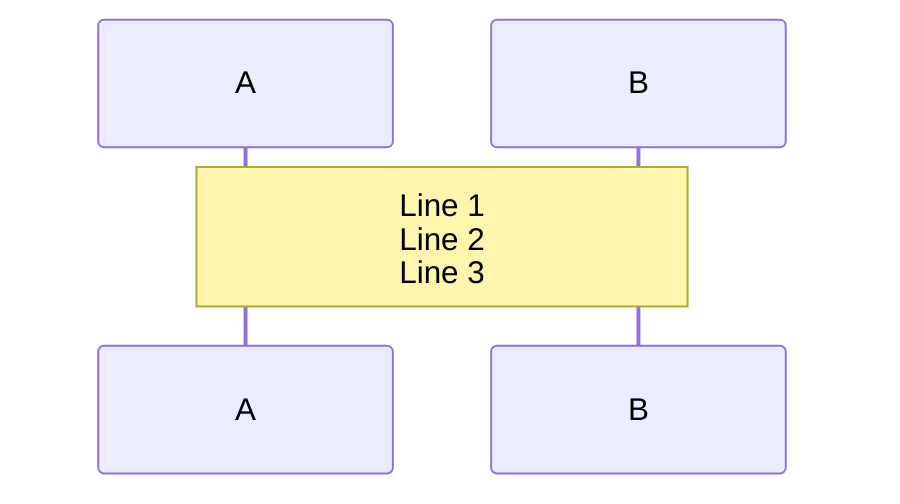

---

## Loops and Alternatives

### Loop

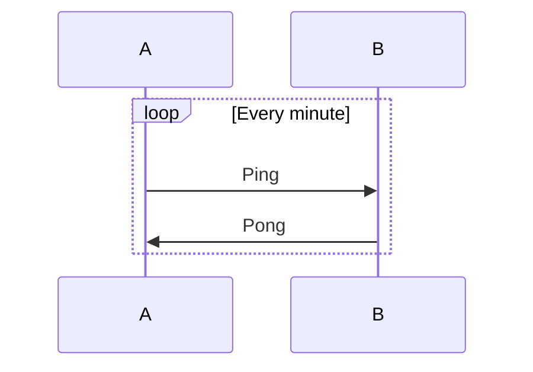

### Alt (If-else)

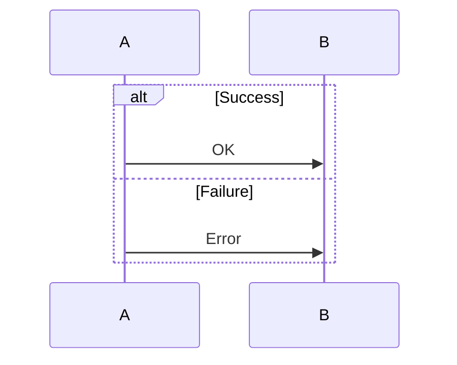

### Opt (Optional)

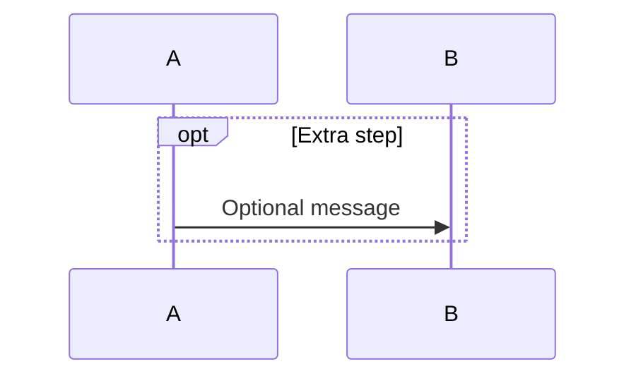

### Par (Parallel)

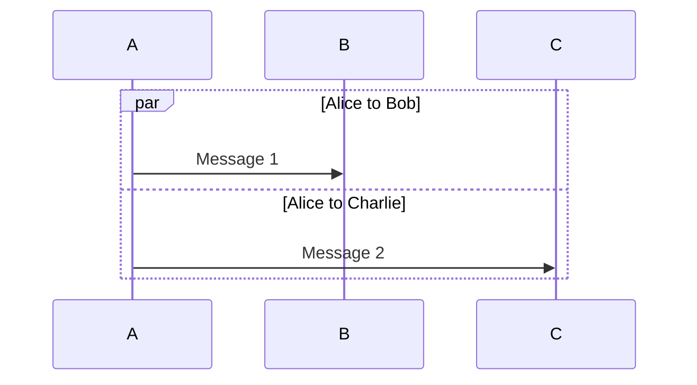

---

## Background Highlighting

### Rect

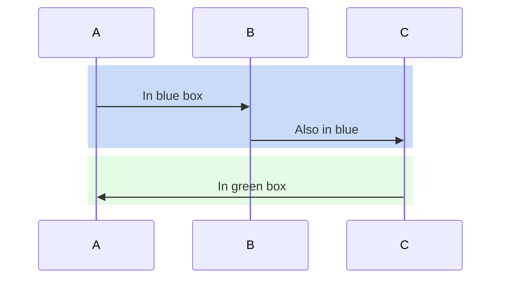

---

## Autonumbering

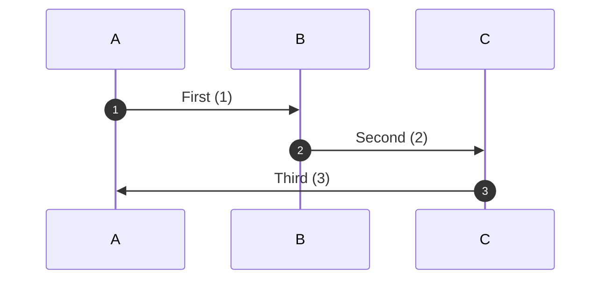

---

## Special Features

### Critical Section

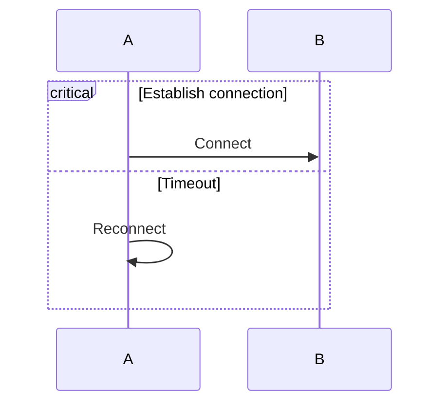

### Break

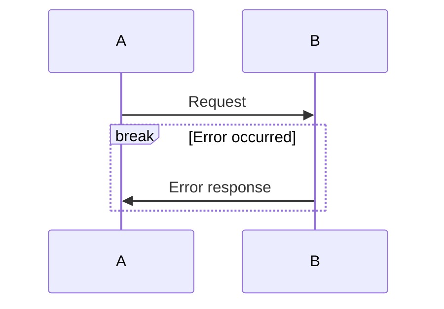

---

## Sequence Numbers

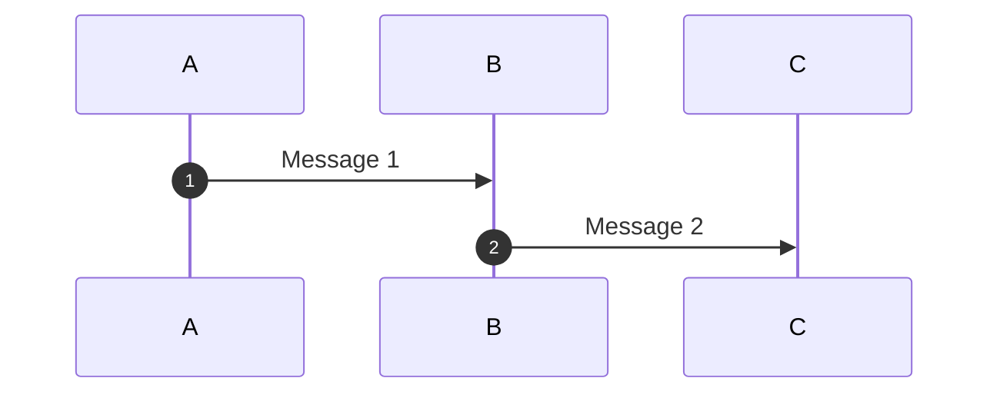

---

## Links and Styling

### Participant Links

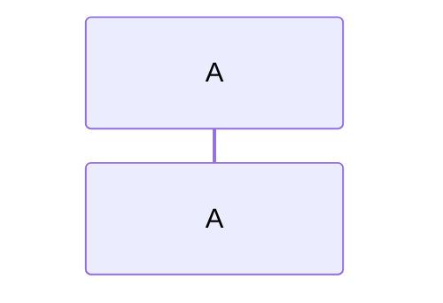

### Styling

```mermaid
sequenceDiagram
    participant A
    participant B

    A->>B: Message

    style A fill:#bbf
```

---

## Common Patterns

### Request-Response

```mermaid
sequenceDiagram
    Client->>Server: Request
    Server-->>Client: Response
```

### Error Handling

```mermaid
sequenceDiagram
    A->>B: Request
    alt Success
        B->>A: Data
    else Error
        B->>A: Error message
    end
```

### Async Operations

```mermaid
sequenceDiagram
    A-)B: Async call
    Note over B: Processing...
    B--)A: Callback
```

---

## Best Practices

1. **Use aliases:** `participant A as Alice` for readability
2. **Activation:** Use `+`/`-` for clear lifelines
3. **Notes:** Add context for complex flows
4. **Grouping:** Use rect for related operations
5. **Autonumber:** For step-by-step flows

---

## Errors to Avoid

1. **Don't use flowchart syntax:**
   - ❌ `A[Rectangle]` (flowchart syntax)
   - ✅ `participant A` (sequence syntax)

2. **Special chars in messages:**
   - ❌ `A->>B: method()`
   - ✅ `A->>B: method call`

3. **Missing participant:**
   - Define all participants before using

---

## Complete Example

```mermaid
sequenceDiagram
    autonumber
    actor User
    participant App
    participant Server
    participant DB

    User->>+App: Login request
    App->>+Server: Authenticate

    alt Valid credentials
        Server->>+DB: Query user
        DB-->>-Server: User data
        Server-->>App: Token
        App-->>-User: Success
    else Invalid credentials
        Server-->>App: Error
        App-->>-User: Login failed
    end

    Note over User,DB: Authentication complete
```

---

Return to [SKILL.md](SKILL.md)
